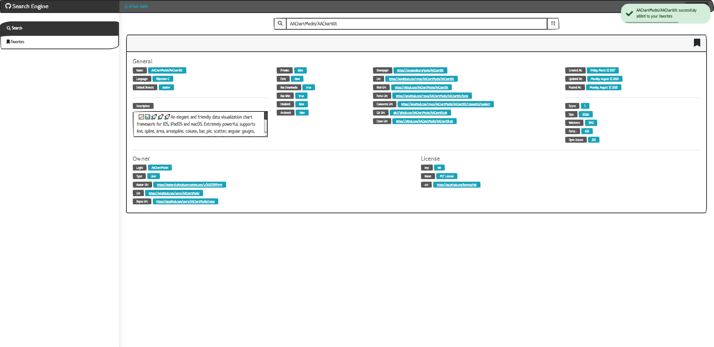
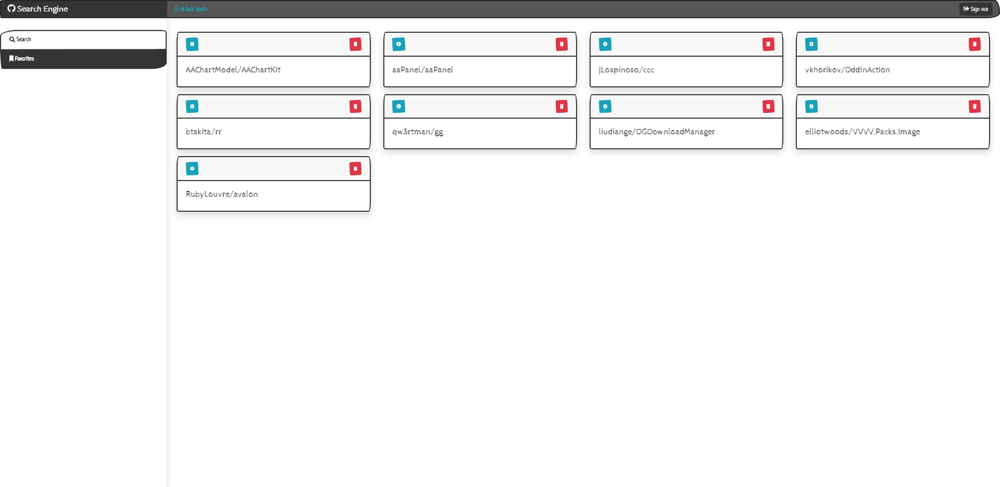

# github-search-client-app
___

Esses Projeto Foi Gerado Com [Angular CLI](https://github.com/angular/angular-cli) version 10.0.5.
___

## Screenshot

## Development server

Rode o Comando `ng serve` Para Executar o Servidor Dev. Navegue para `http://localhost:4200/`. O Programa Sempre Ira Atualizar Automaticamente Assim que vc Alterar e Salvar Algum Arquivo.
